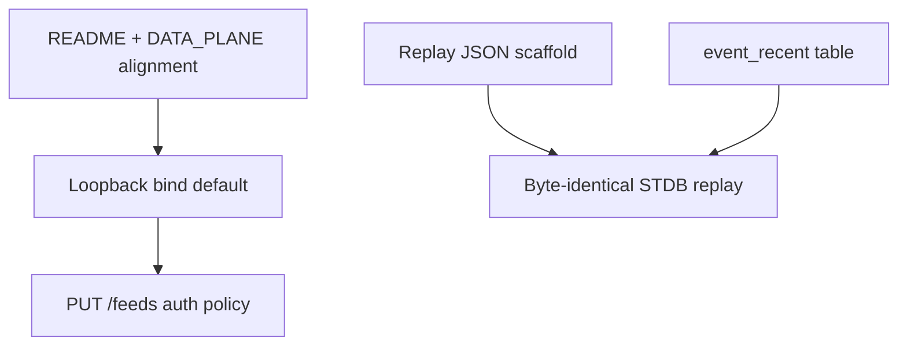

# Phase A — Trust & truth (P0)

**Goal:** Production-safe edges, provable determinism, accurate onboarding docs.

**Exit criteria (principal review):**

- Replay scaffold runs in CI (`cargo test -p openatlas-stdb-module --test replay_harness`).
- README / ARCHITECTURE table caps match `lib.rs` (800 / 400 / 600 + 24h).
- Ingest defaults to loopback bind; mutating `/feeds` routes fail closed on non-loopback without `OPENATLAS_API_KEY`.
- Browser sync economics documented (~800 sync vs ~800 UI 24h trim; `event_recent` design noted).
- Staging deploy runbook executed once (see Phase C).

---

## Checklist

### Documentation & alignment

| Status | Item | Notes | Code / deps |
|--------|------|-------|-------------|
| [x] | **README schema caps** | Event 800+24h, signal 400, causal 600; `ingest_audit` 2000 private | [`README.md`](../../README.md), [`lib.rs`](../../crates/openatlas-stdb-module/src/lib.rs) |
| [x] | **ARCHITECTURE table caps** | Already aligned | [`ARCHITECTURE.md`](../../ARCHITECTURE.md) |
| [x] | **DATA_PLANE memory bounds** | UI 24h trim + `MAX_EVENTS=800` (hard 2000); STDB rings 800/400/600 | [`DATA_PLANE.md`](../DATA_PLANE.md), [`event-retention-trim.ts`](../../web/src/lib/event-retention-trim.ts) |
| [x] | **CONFIG ingest bind + API key** | `OPENATLAS_BIND`, `OPENATLAS_API_KEY`, header `x-openatlas-key` | [`CONFIG.md`](../CONFIG.md) |

### Ingest security

| Status | Item | Notes | Code / deps |
|--------|------|-------|-------------|
| [x] | **Default bind `127.0.0.1:8080`** | Override with `OPENATLAS_BIND` | [`main.rs`](../../crates/openatlas-ingest/src/main.rs), [`auth.rs`](../../crates/openatlas-ingest/src/auth.rs) |
| [x] | **Mutating `/feeds` auth** | Non-loopback: require `OPENATLAS_API_KEY`; loopback: require key when env set | [`auth.rs`](../../crates/openatlas-ingest/src/auth.rs), [`routes/feeds.rs`](../../crates/openatlas-ingest/src/routes/feeds.rs) |
| [x] | **Auth tests** | 401 without key on non-loopback; PUT with key on loopback | [`tests/admin_auth.rs`](../../crates/openatlas-ingest/tests/admin_auth.rs) |
| [ ] | **Secrets via `AppState`** | Remove `unsafe set_var` for feed keys | Depends on feed worker refactor — [`feed_config.rs`](../../crates/openatlas-ingest/src/feed_config.rs) |

### Determinism & replay

| Status | Item | Notes | Code / deps |
|--------|------|-------|-------------|
| [~] | **Replay harness scaffold** | JSON fixture → `WorldGraph` oracle; row-count assertions; documents byte-identical STDB target | [`tests/replay_harness.rs`](../../crates/openatlas-stdb-module/tests/replay_harness.rs), [`fixtures/replay_minimal.json`](../../crates/openatlas-stdb-module/tests/fixtures/replay_minimal.json) |
| [ ] | **Full STDB replay + snapshot hash** | Publish module, replay reducer log, hash tables | Depends on CI STDB instance — blocks on infra |
| [ ] | **Nightly replay job** | GitHub Actions workflow | Depends on full STDB replay |

### Browser sync economics

| Status | Item | Notes | Code / deps |
|--------|------|-------|-------------|
| [x] | **Document sync ~800 vs UI trim** | Client 24h retention + 800 cap; R1 `event_recent` table still deferred | [`DATA_PLANE.md`](../DATA_PLANE.md#browser-subscription-vs-ui-trim), [`data-limits.ts`](../../web/src/lib/data-limits.ts), [`event-retention-trim.ts`](../../web/src/lib/event-retention-trim.ts) |
| [ ] | **`event_recent` STDB table** | Cap ~300 rows for browser-facing sync | **Deferred** — schema below; needs `spacetime publish` + `spacetime generate` + dual-maintain on `ingest_event` |

#### `event_recent` target schema (not implemented)

```rust
/// Browser-facing cap — subscribe instead of full `event` ring.
const EVENT_RECENT_CAP: u64 = 300;

#[spacetimedb::table(name = event_recent, accessor = event_recent, public)]
pub struct EventRecent {
    #[primary_key]
    pub id: u64,
    pub timestamp: Timestamp,
    pub domain: u8,
    pub severity_score: f64,
    pub location: Option<Location>,
    pub payload_json: String,
    pub ordinal: u64,
}
```

**Reducer contract:** on each successful `ingest_event`, upsert `event_recent` by `id`; after upsert, delete rows with ordinal below `(max_ordinal - EVENT_RECENT_CAP)` (mirror `prune_events_over_ring_size` ordering). **Web:** add `event_recent` to `CORE_SUBSCRIPTION_QUERIES`, project in `sync-dashboard-cache.ts`, keep full `event` subscription only for admin/debug until validated.

### Connection & errors

| Status | Item | Notes | Code / deps |
|--------|------|-------|-------------|
| [x] | **STDB reconnect backoff** | Exponential retry (8×, 2s base); OpsStrip + Settings banner; manual Reconnect | [`connection.svelte.ts`](../../web/src/lib/connection.svelte.ts), [`OpsStrip.svelte`](../../web/src/lib/components/OpsStrip.svelte) |
| [x] | **Error codes → remediation** | Map `connectionLastError` to operator copy | [`connection-errors.ts`](../../web/src/lib/connection-errors.ts), Settings + OpsStrip |
| [ ] | **Structured skip logging (dev)** | Count + reason when `state.svelte.ts` drops malformed rows | [`state.svelte.ts`](../../web/src/lib/state.svelte.ts) |

### Observability (Phase A slice)

| Status | Item | Notes | Code / deps |
|--------|------|-------|-------------|
| [x] | **Prometheus scrape endpoint** | `GET /metrics` on ingest | [`metrics.rs`](../../crates/openatlas-ingest/src/metrics.rs) — fuller SLO dashboard in Phase C |

---

## Dependencies (within phase)



- **Auth** should land before any production bind to `0.0.0.0`.
- **`event_recent`** is independent of replay scaffold but both address R1 (subscription economics).

---

## Byte-identical replay contract (target)

From [`OPENATLAS_SPEC.md`](../../OPENATLAS_SPEC.md): a recorded reducer log replayed against a fresh SpacetimeDB instance must produce **byte-identical** public table contents.

**Scaffold (current):** host test applies the same ordered `ingest_event` payloads to [`WorldGraph`](../../crates/openatlas-core/src/graph.rs) and asserts expected row counts. This validates fixture shape and ordering; it does **not** replace WASM reducer replay.

**Next:** drive reducers over HTTP against a test database and compare canonical row hashes per table.
