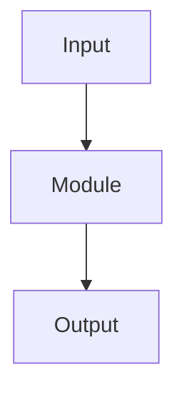

# Technical Specification: [Feature / System Name]

**Date**: [YYYY-MM-DD]
**Status**: [Draft | Review | Approved]

---

## 1. Problem Statement

_What need does this address? Who is the user? What is the expected outcome?_

## 2. Requirements

### Functional

- [ ] Requirement 1
- [ ] Requirement 2

### Non-Functional

- [ ] Performance: [latency, throughput requirements]
- [ ] Security: [auth, data protection concerns]
- [ ] Reliability: [uptime, error budget]
- [ ] Observability: [logging, metrics, tracing]

## 3. Design

### 3.1 Overview

_High-level description of the solution. Include a diagram if helpful._



### 3.2 Data Model

_Key types, entities, or data structures._

```typescript
interface User {
  id: string;
  name: string;
}
```

### 3.3 API / Interface

```
POST /api/v1/resource
Request:  { ... }
Response: { ... }
Errors:   { code, message }
```

### 3.4 Error Handling

_What can go wrong? How will each case be handled?_

### 3.5 Testing Strategy

| Layer | Approach | Coverage Target |
|-------|----------|-----------------|
| Unit | | |
| Integration | | |
| E2E | | |

## 4. Implementation Plan

### Phase 1 — Minimal Viable

_What is the smallest useful slice?_

- [ ] Step 1
- [ ] Step 2

### Phase 2 — Hardening

_What makes it robust?_

- [ ] Error handling
- [ ] Edge cases
- [ ] Performance optimisation

### Phase 3 — Polish

_What makes it complete?_

- [ ] Documentation
- [ ] Monitoring

## 5. Open Questions

1. ...
2. ...

---

_Generated by [AI/tool name]. Reviewed by [name]._
